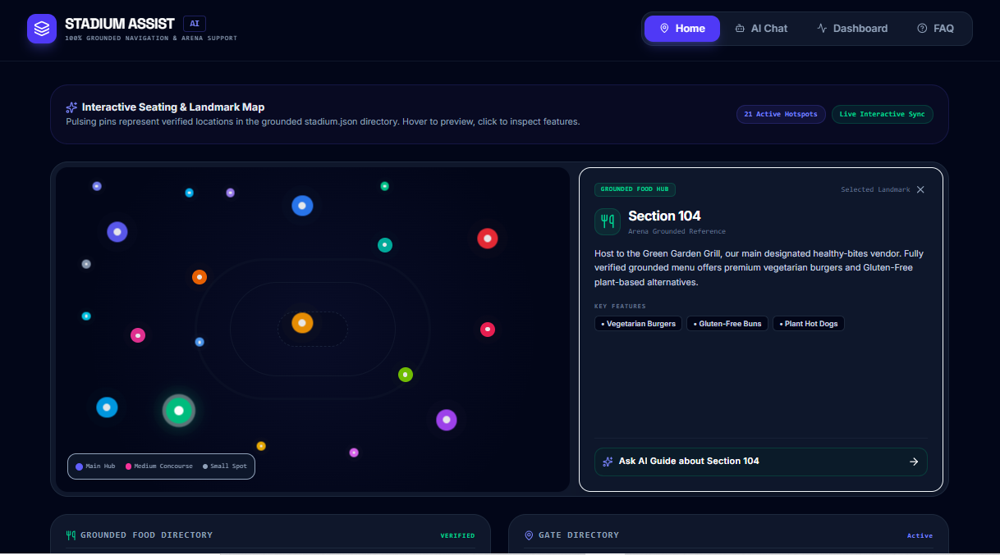
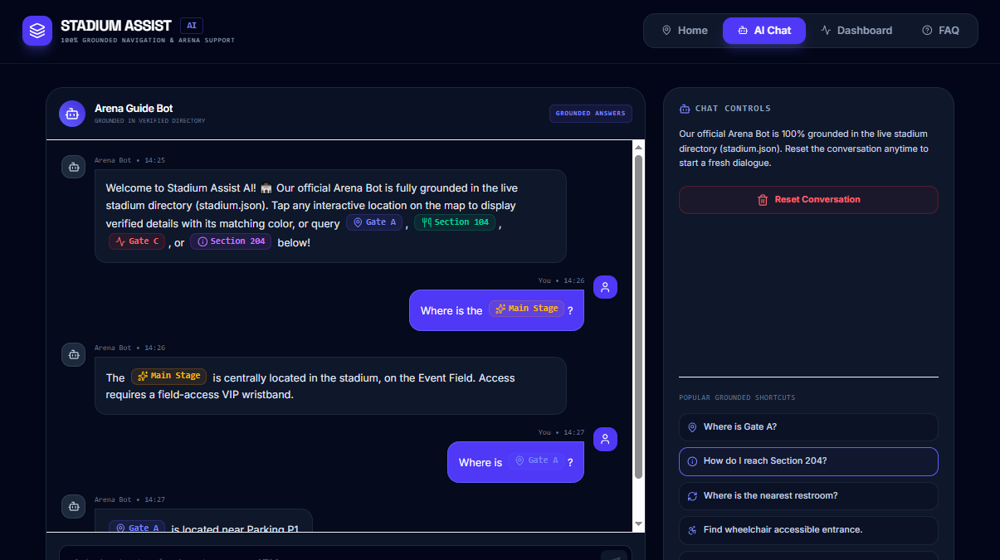
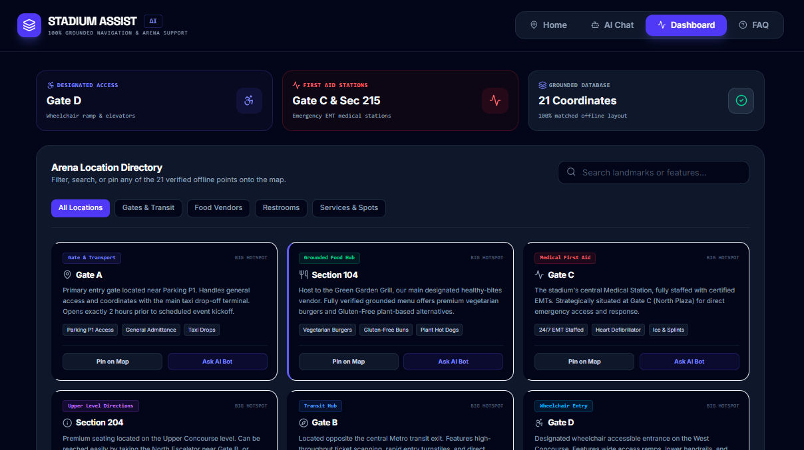
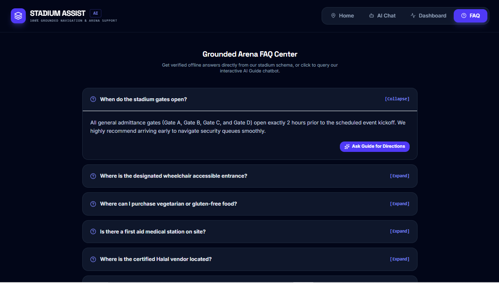

# Stadium Assist AI 🏟️🤖

> AI-powered stadium navigation and fan assistance platform built for the FIFA World Cup 2026 experience.

Stadium Assist AI is a GenAI-enabled web application that helps fans, volunteers, organizers, and venue staff quickly access stadium information through natural language conversations. The system provides accurate, grounded, and real-time assistance for navigation, accessibility, facilities, food vendors, medical support, and venue operations while preventing AI hallucinations through a stadium-specific knowledge base.

## 🛠️ Technology Stack Badges

<div align="center">


</div>

---

## 🌐 Live Demo

🔗 **Live Application:** [Add Live URL Here]

🔗 **GitHub Repository:** https://github.com/sundarAlok/Stadium-Assist-AI.git

---

## 📸 Screenshots

### Home Interface


### AI Assistant Chat


### Quick Stadium Dashboard


### Accessibility Assistance


> Place screenshots inside `/screenshots` folder and update paths if necessary.

---

## 🎥 Demo Video

📺 **Demo Video:** [Add YouTube / Loom Link Here]

---

# 🏆 Hackathon Problem Statement Alignment

### Challenge

Build a GenAI-enabled solution that enhances stadium operations and the overall tournament experience for fans, organizers, volunteers, or venue staff during the FIFA World Cup 2026.

### How Stadium Assist AI Solves It

✅ Stadium Navigation Assistance

✅ Accessibility Support

✅ Multilingual AI-Ready Architecture

✅ Venue Operations Intelligence

✅ Medical & Emergency Guidance

✅ Fan Experience Enhancement

✅ Grounded Real-Time Information Retrieval

✅ AI-Powered Decision Support

---

# 🚀 Key Features

### 🤖 AI Stadium Assistant

Ask natural language questions such as:

- Where is Gate B?
- How do I reach Section 204?
- Where is the nearest restroom?
- Where can I find vegetarian food?
- Where is the medical station?
- Where is the wheelchair accessible entrance?

---

### 🧭 Smart Navigation

Provides step-by-step stadium directions for:

- Gates
- Sections
- Food Courts
- Restrooms
- Accessibility Entrances
- Medical Stations

---

### ♿ Accessibility First

Designed with accessibility as a core feature:

- Wheelchair entrance guidance
- Elevator locations
- Accessible restroom information
- Keyboard navigation support
- Screen reader support
- WCAG-friendly UI

---

### 🛡️ Hallucination-Free Responses

Unlike generic AI chatbots, Stadium Assist AI only answers using verified stadium information.

If information does not exist:

```text
I don't have that information.
```

This guarantees trust and reliability for fans.

---

### 🔄 Intelligent Fallback System

If the AI provider becomes unavailable:

- Automatic local search fallback
- Stadium data remains accessible
- No service interruption

---

## 🏗️ Technology Stack

### Frontend

- React 19
- TypeScript
- Vite
- Tailwind CSS
- Motion
- Lucide Icons

### Backend

- Node.js
- Express.js
- TypeScript

### AI

- GROQ API
- Llama 3.3 70B Versatile

### Testing

- Node.js Native Test Runner
- Supertest

### Security

- Helmet
- CORS Protection
- Environment Variables
- Server-side AI Integration

---

## 🏅 Technical Advantages

### Grounded AI Architecture

Instead of relying on open-ended LLM responses:

```text
User Query
      ↓
Stadium Knowledge Base
      ↓
Grounded Validation
      ↓
Groq LLM
      ↓
Verified Response
```

This dramatically reduces hallucinations.

---

### Fast Response Time

Using GROQ's inference infrastructure:

- Low latency responses
- Fast stadium information retrieval
- Scalable for thousands of concurrent users

---

### Offline-Friendly Design

Local fallback search ensures:

- Operational resilience
- Reduced downtime
- Reliable event-day performance

---

# 📂 Project Structure

```text
stadium-assist-ai/
│
├── client/
│   ├── src/
│   │   ├── components/
│   │   ├── types.ts
│   │   ├── App.tsx
│   │   └── index.css
│   │
│   └── index.html
│
├── server/
│   ├── data/
│   │   └── stadium.json
│   │
│   └── ai.ts
│
├── tests/
│   └── api.test.ts
│
├── server.ts
├── package.json
├── .env.example
└── README.md
```

---

# 📚 Stadium Knowledge Base

The application uses a structured local JSON knowledge base containing:

### Gates

- Gate A
- Gate B
- Gate C
- Gate D

### Food Vendors

- Vegetarian Options
- Gluten-Free Options
- Halal Food
- Arena Bites

### Accessibility

- Wheelchair Entrances
- Elevators
- Accessible Restrooms

### Facilities

- Restrooms
- Medical Stations
- Information Points

### Stadium Sections

- Navigation Instructions
- Directional Guidance
- Accessibility Routes

---

# 📡 API Documentation

## Health Check

### Request

```http
GET /api/health
```

### Response

```json
{
  "status": "healthy",
  "timestamp": "2026-07-17T06:34:07.000Z"
}
```

---

## AI Chat Endpoint

### Request

```http
POST /api/chat
```

```json
{
  "message": "Where is Gate B?"
}
```

### Response

```json
{
  "reply": "Gate B is near the north parking entrance..."
}
```

---

## Tabs Endpoint

### Request

```http
GET /api/tabs
```

### Response

```json
{
  "tabs": [
    "Navigation",
    "Food",
    "Accessibility",
    "Medical"
  ]
}
```

---

# ⚙️ Environment Setup

Create a `.env` file:

```env
GROQ_API_KEY=your_groq_api_key
APP_URL=http://localhost:3000
```

---

# 🛠️ Installation

### Clone Repository

```bash
git clone <repository-url>
cd stadium-assist-ai
```

### Install Dependencies

```bash
npm install
```

### Configure Environment

```bash
cp .env.example .env
```

### Start Development Server

```bash
npm run dev
```

Application runs at:

```text
http://localhost:3000
```

---

# 🧪 Testing

The project includes automated API tests covering:

- Health endpoint validation
- Grounded AI responses
- Empty prompt handling
- Missing prompt validation
- Invalid JSON handling
- Unknown query handling
- API schema verification

Run tests:

```bash
npx tsx --test tests/api.test.ts
```

Example output:

```text
✔ Health endpoint works
✔ Chat endpoint returns 200
✔ Empty prompt returns 400
✔ Missing prompt returns 400
✔ Unknown query handled
✔ Invalid JSON handled
✔ Tabs endpoint schema valid

Pass: 7
Fail: 0
```

---

# 🔒 Security Measures

### Implemented

- Environment Variable Protection
- Server-Side AI Calls
- Secure API Architecture
- Request Validation
- Error Handling
- CORS Protection
- Helmet Security Headers

### Future Enhancements

- Rate Limiting
- JWT Authentication
- Redis Caching
- Audit Logging

---

# ♿ Accessibility Features

- Keyboard Navigable UI
- WCAG-Compliant Contrast Ratios
- Semantic HTML Structure
- Focus Management
- Screen Reader Friendly Labels
- Accessible Touch Targets (44px+)

---

# 🌎 Future Roadmap

### Phase 1

- Multi-language Support
- Voice Assistance

### Phase 2

- Real-Time Crowd Density Monitoring
- Dynamic Route Optimization

### Phase 3

- Transportation Assistance
- Smart Parking Guidance
- Emergency Evacuation Guidance

### Phase 4

- FIFA World Cup Multi-Stadium Deployment
- Volunteer Operations Dashboard
- AI Operations Command Center

---

# 📈 Project Evaluation Mapping

| Category | Contribution |
|-----------|------------|
| Code Quality | Modular architecture, TypeScript, reusable components |
| Security | Environment variables, server-side AI, validation |
| Efficiency | GROQ inference + local fallback search |
| Testing | Automated API test suite |
| Accessibility | WCAG-friendly design and navigation |
| Problem Alignment | Direct stadium assistance for FIFA World Cup scenarios |

---

# 👨‍💻 Team

Built for the **Promptwars Hackathon**.

Empowering fans with AI-driven stadium experiences for the FIFA World Cup 2026.